```mermaid
graph LR
    A[🧠 LLM Research] --> B[🔬 Advanced Transformers]
    A --> C[⚡ Edge Optimization]
    D[🎯 MLOps] --> E[🚀 Model Deployment]
    D --> F[📊 ML Monitoring]
    G[🎮 Reinforcement Learning] --> H[🏆 Multi-Agent Systems]
    G --> I[🎯 Policy Gradients]
    
    style A fill:#00d9ff,stroke:#fff,stroke-width:2px,color:#000
    style D fill:#ff6b6b,stroke:#fff,stroke-width:2px,color:#000
    style G fill:#4ecdc4,stroke:#fff,stroke-width:2px,color:#000
```

<div align="center">

# 🚀 REX HAMILTON


</div>

<div align="center">

[](https://git.io/typing-svg)

</div>

<div align="center">
  

[](https://github.com/daveshenal)
[](https://github.com/daveshenal)

</div>

<br>


##  ABOUT ME


```typescript
const DaveShenal = {
    role: "Associate ML Engineer",
    education: "Final Year CS Undergrad",
    location: "🌍 Building AI Solutions Globally",
    
    expertise: {
        ai_ml: ["LLMs", "Computer Vision", "Reinforcement Learning"],
        cloud: ["Azure", "MLOps", "Scalable AI Systems"],
        development: ["Full-Stack", "Mobile", "Cross-Platform"]
    },
    
    currentFocus: "🔬 Pushing boundaries in AI research",
    philosophy: "💡 Code today, shape tomorrow",
    
    workingOn: [
        "🤖 Advanced Transformer Architectures",
        "🎯 Production ML Systems",
        "⚡ Edge AI Optimization"
    ]
};
```

<br clear="right">


##  TECH ARSENAL

<div align="center">

### 🧠 AI & Machine Learning
<p>


</p>

### 🌐 Web Development
<p>

</p>

### 💾 Databases & Backend
<p>

</p>

### ☁️ Cloud & DevOps
<p>

</p>

### 📱 Mobile & Tools
<p>

</p>

</div>


##  GITHUB ANALYTICS

<div align="center">


### 📊 Contribution Graph
[](https://github.com/daveshenal)

</div>


##  FEATURED PROJECTS

<div align="center">

<table>
<tr>
<td width="50%">

### 🤖 AI & Machine Learning


- **LLM Fine-tuning Pipeline** 🧠
- **Computer Vision Suite** 👁️
- **RL Game Agent** 🎮
- **Neural Style Transfer** 🎨

</td>
<td width="50%">

### 🌐 Full-Stack Applications  


- **AI-Powered Web Platform** ⚡
- **Flutter Mobile App** 📱
- **Cloud Microservices** ☁️
- **Real-time Analytics** 📊

</td>
</tr>
</table>

</div>


##  CURRENT QUESTS

<div align="center">



</div>


##  LET'S CONNECT

<div align="center">

<a href="https://linkedin.com/in/yourprofile">

</a>

<a href="mailto:your.email@example.com">

</a>

<a href="https://twitter.com/yourhandle">

</a>

<a href="https://discord.gg/yourserver">

</a>

</div>

<br>

<div align="center">

### 🎯 Open for Collaboration • 🚀 Always Learning • 💡 Innovation Driven

</div>


<div align="center">

*"The future belongs to those who code it into existence."* ⚡

---


**Thanks for visiting! Star ⭐ some repositories if you find them interesting!**

</div>
